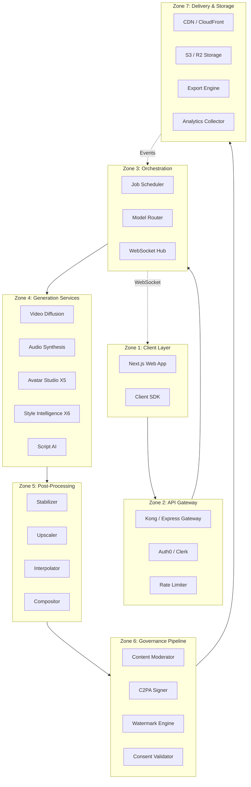
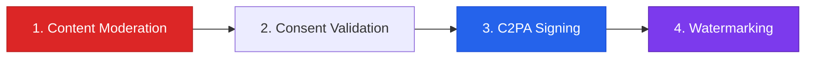
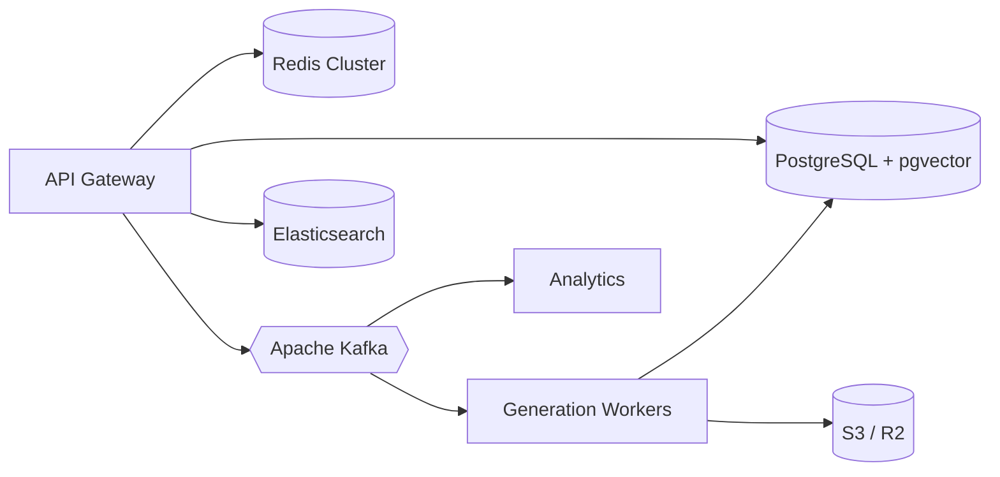
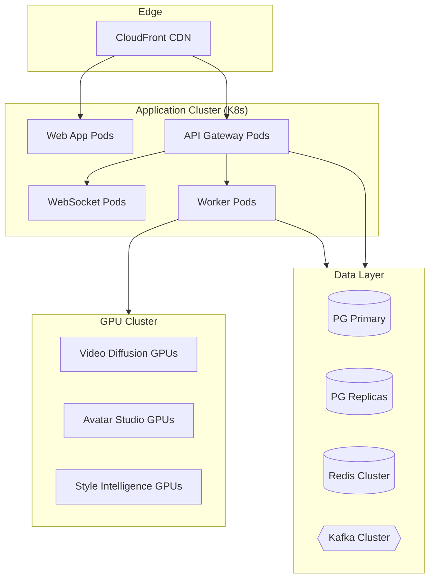

# AnimaForge System Architecture

## Overview

AnimaForge is a distributed production operating system composed of specialized services orchestrated through a central API gateway, sharing a common data layer, event bus, and governance pipeline. The platform transforms text scripts and creative direction into fully rendered, provenance-tracked animated video.

---

## 7 Architecture Zones

### Zone 1: Client Layer
- **Next.js 14+ Web App** — App Router, TypeScript, Tailwind CSS, Radix UI
- **State Management** — Zustand stores + TanStack Query for server state
- **3D Rendering** — Three.js for avatar preview and timeline visualization
- **Client SDK** — TypeScript SDK for third-party integrations

### Zone 2: API Gateway
- **Kong / Express** — Unified routing, request transformation, CORS
- **Auth0 / Clerk** — JWT-based authentication with RBAC (admin, creator, editor)
- **Rate Limiting** — Redis-backed sliding window (60/300/1000 req/min by tier)
- **Request Validation** — Zod schemas for all inbound payloads

### Zone 3: Orchestration Layer
- **Job Scheduler** — BullMQ (Node.js) + Celery (Python) for job queuing and priority
- **Model Router** — Selects optimal GPU instance based on model, quality, and queue depth
- **WebSocket Hub** — Socket.IO for real-time collaboration, presence, and progress streaming

### Zone 4: Generation Services
- **Video Diffusion** — Custom video diffusion model (AnimaForge-V2) on GPU clusters
- **Audio Synthesis** — Music, SFX, and dialogue generation
- **Avatar Studio (X5)** — 7-step 3D reconstruction pipeline
- **Style Intelligence (X6)** — Style fingerprinting and transfer engine
- **Script AI** — Script parsing, shot decomposition, and prompt generation

### Zone 5: Post-Processing
- **Stabilizer** — Frame-level motion stabilization
- **Upscaler** — AI super-resolution (up to 4K)
- **Interpolator** — Frame interpolation for smooth motion (24/30/60fps)
- **Compositor** — Layer compositing, transitions, and effects

### Zone 6: Governance Pipeline
- **Content Moderator** — NSFW, violence, bias, and copyright detection
- **C2PA Signer** — Content Credentials manifest creation and signing
- **Watermark Engine** — Invisible spectral watermarking
- **Consent Validator** — Likeness rights verification

### Zone 7: Delivery & Storage
- **CDN** — CloudFront / Cloudflare for global edge delivery
- **S3 / R2** — Object storage for assets, outputs, and manifests
- **Export Engine** — MP4, WebM, ProRes, and image sequence export
- **Analytics Collector** — Usage metrics, quality scores, and billing events

---

## 11-Stage Generation Pipeline

```mermaid
flowchart LR
  S1[1. Script Input] --> S2[2. Script Parsing]
  S2 --> S3[3. Shot Decomposition]
  S3 --> S4[4. Character Binding]
  S4 --> S5[5. Style Application]
  S5 --> S6[6. Video Diffusion]
  S6 --> S7[7. Audio Synthesis]
  S7 --> S8[8. Post-Processing]
  S8 --> S9[9. Compositing]
  S9 --> S10[10. Quality Assessment]
  S10 --> S11[11. Output Packaging]

  style S6 fill:#7c3aed,stroke:#5b21b6,color:#fff
  style S10 fill:#059669,stroke:#047857,color:#fff
```

| Stage | Service | Description |
|-------|---------|-------------|
| 1. Script Input | Web Client | User enters script text, creative brief, or uploads screenplay |
| 2. Script Parsing | Script AI | NLP extracts scenes, dialogue, actions, and emotions |
| 3. Shot Decomposition | Script AI | Breaks scenes into individual shots with camera directions |
| 4. Character Binding | Orchestrator | Maps characters to shots, loads identity embeddings |
| 5. Style Application | Style Intelligence | Applies style fingerprint (palette, textures, lighting) |
| 6. Video Diffusion | Video Diffusion | Generates raw video frames via AnimaForge-V2 model |
| 7. Audio Synthesis | Audio Engine | Generates music, SFX, and dialogue synchronized to video |
| 8. Post-Processing | Post-Processing | Stabilization, upscaling, frame interpolation |
| 9. Compositing | Compositor | Layers, transitions, text overlays, final assembly |
| 10. Quality Assessment | Orchestrator | Automated quality scoring (motion, consistency, fidelity) |
| 11. Output Packaging | Export Engine | Encode final formats, generate thumbnails, metadata |

---

## 4-Stage Governance Pipeline

Every generated output passes through all 4 governance stages before delivery:

1. **Content Moderation** — Automated scanning for NSFW, violence, bias, and potential copyright violations. Outputs exceeding thresholds are flagged for human review.
2. **Consent Validation** — Verifies that all character likenesses used have valid consent records. Blocks delivery if any character lacks approval.
3. **C2PA Signing** — Creates and attaches a Content Credentials manifest documenting the full generation chain: model, inputs, parameters, and timestamps.
4. **Watermarking** — Embeds an invisible spectral watermark encoding output ID, creator, and timestamp. Survives compression, cropping, and re-encoding.

---

## Data Flow

- **PostgreSQL 16 + pgvector** — Primary datastore for all entities; pgvector for character embedding similarity search
- **Redis Cluster** — Session cache, rate limiting, BullMQ job queues, real-time presence
- **Apache Kafka** — Event bus for async communication between services (job events, audit log, analytics)
- **Elasticsearch 8** — Full-text search for projects, characters, assets, and marketplace
- **S3 / R2** — Object storage for all binary assets (images, video, audio, 3D models, manifests)

---

## Deployment Topology

- **Kubernetes** — All application services run on K8s with horizontal pod autoscaling
- **GPU Cluster** — Dedicated GPU nodes (A100/H100) for inference workloads
- **Database** — Primary + read replicas with streaming replication
- **CI/CD** — GitHub Actions for builds and tests, ArgoCD for GitOps deployments
