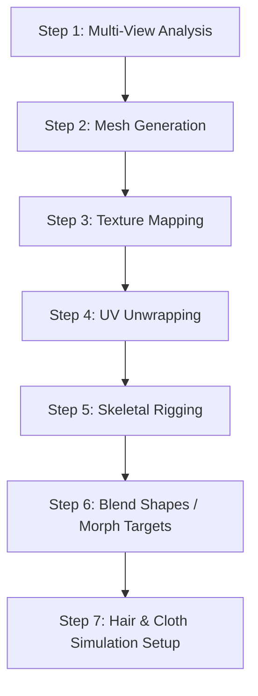

# Avatar Studio (X5)

## Overview

Avatar Studio (internal codename X5) is AnimaForge's 3D avatar reconstruction and animation system. It transforms 2D reference images of a character into a fully rigged, animatable 3D digital twin suitable for use in the video generation pipeline.

---

## 7-Step Reconstruction Pipeline



### Step 1: Multi-View Analysis

**Input**: 2-10 reference images from different angles (front, side, back, three-quarter)

**Process**:
- Run CLIP ViT-L/14 to extract identity embeddings (512-dim vectors stored in pgvector)
- Estimate camera poses for each reference image using PnP solver
- Generate a dense point cloud using multi-view stereo reconstruction
- Detect facial landmarks (68-point) and body keypoints (17-point COCO format)
- If fewer than 3 views are provided, use a view synthesis model to hallucinate missing angles

**Output**: Point cloud, camera poses, identity embedding, landmarks

### Step 2: Mesh Generation

**Input**: Point cloud and landmarks from Step 1

**Process**:
- Convert point cloud to signed distance field (SDF) using neural implicit representation
- Extract mesh surface via Marching Cubes at configurable resolution (64k-256k polygons)
- Apply Laplacian smoothing to reduce artifacts
- Enforce bilateral symmetry for humanoid characters
- Topology remeshing for animation-friendly edge flow (quad-dominant mesh)

**Output**: Clean quad-dominant mesh with 50k-200k polygons

### Step 3: Texture Mapping

**Input**: Mesh + reference images + camera poses

**Process**:
- Project reference images onto mesh faces using estimated camera poses
- Resolve projection conflicts in overlapping regions via confidence-weighted blending
- Inpaint occluded regions using a texture completion network
- Generate PBR texture maps:
  - **Albedo** (diffuse color): 4096x4096
  - **Normal** map: 4096x4096
  - **Roughness** map: 2048x2048
  - **Metallic** map: 2048x2048

**Output**: Complete PBR texture set

### Step 4: UV Unwrapping

**Input**: Textured mesh

**Process**:
- Automatic UV seam placement minimizing visible seams on prominent features
- ABF++ (Angle-Based Flattening) parameterization for low distortion
- Pack UV islands with 2-pixel padding to prevent bleeding
- Optimize UV space utilization (target > 85% usage)
- Re-bake textures to final UV layout

**Output**: UV-mapped mesh with optimized atlas layout

### Step 5: Skeletal Rigging

**Input**: UV-mapped mesh + body keypoints

**Process**:
- Fit a template skeleton hierarchy to detected keypoints:
  - **Humanoid**: 65 bones (spine chain, limbs, fingers, face)
  - **Creature**: Adaptive bone count based on anatomy detection
  - **Robot**: Rigid body hierarchy with joint constraints
- Compute automatic skinning weights using geodesic voxel binding
- Refine weights with heat diffusion method for smooth deformation
- Set joint limits and IK constraints for physically plausible motion
- Validate with a set of canonical poses (T-pose, A-pose, sitting, walking)

**Output**: Rigged skeleton with skinning weights

### Step 6: Blend Shapes / Morph Targets

**Input**: Rigged mesh + facial landmarks

**Process**:
- Generate 52 ARKit-compatible blend shapes for facial animation:
  - Brow controls (4): `browInnerUp`, `browDown_L`, `browDown_R`, `browOuterUp_L/R`
  - Eye controls (14): blink, squint, wide, look directions
  - Mouth controls (24): open, smile, frown, pucker, funnel, etc.
  - Jaw/cheek/nose (10): jaw open, cheek puff, nose sneer, etc.
- Each blend shape is a delta mesh from the neutral expression
- Validate blend shape orthogonality (no unintended cross-activation)
- Generate FACS (Facial Action Coding System) mapping for expression control

**Output**: 52 blend shapes + FACS mapping table

### Step 7: Hair & Cloth Simulation Setup

**Input**: Complete rigged mesh with blend shapes

**Process**:
- **Hair Detection**: Segment hair region from reference images using SAM
- **Hair Guide Curves**: Generate guide strands from detected hair volume
  - 500-2000 guide strands depending on complexity
  - Interpolated to 10k-50k render strands
- **Hair Physics**: Assign mass-spring parameters for dynamic simulation
- **Cloth Detection**: Identify clothing boundaries from reference segmentation
- **Cloth Mesh**: Extract cloth submeshes and assign material properties
  - Stiffness, damping, friction coefficients per garment type
- **Simulation Cache**: Pre-compute rest pose and basic motion responses

**Output**: Complete digital twin ready for animation

---

## Rendering Subsystems

### Real-Time Preview (Three.js)
Used in the web client for interactive avatar inspection:
- PBR material rendering with environment mapping
- Blend shape slider controls for expression preview
- Basic skeletal animation playback
- LOD switching based on viewport distance
- Target: 60fps at 720p on mid-range GPUs

### Production Rendering (GPU Cluster)
Used during video generation for final quality output:
- Path-traced global illumination
- Subsurface scattering for skin
- Hair strand rendering with Marschner shading model
- Cloth simulation with Verlet integration
- Motion blur and depth of field
- Target: 24-60fps at 1080p-4K

### Style Transfer Rendering
Applied when a style fingerprint modifies the avatar's appearance:
- NPR (Non-Photorealistic Rendering) shaders for cartoon/anime styles
- Edge detection and outline rendering for cel-shading
- Palette remapping based on style fingerprint colors
- Texture stylization via neural style transfer

---

## Export Formats

| Format | Extension | Use Case |
|--------|-----------|----------|
| **glTF Binary** | `.glb` | Web preview, Three.js integration |
| **glTF Separate** | `.gltf` + `.bin` | Editable format for external tools |
| **FBX** | `.fbx` | Unreal Engine, Maya, Blender import |
| **USD** | `.usd` / `.usda` | Pixar Universal Scene Description |
| **Alembic** | `.abc` | Cached animation/simulation data |
| **OBJ + MTL** | `.obj` | Static mesh with materials (no animation) |

### Export Options

| Option | Values | Description |
|--------|--------|-------------|
| `polygon_budget` | `low` (25k), `medium` (100k), `high` (200k) | Target polygon count |
| `texture_resolution` | `1024`, `2048`, `4096` | Texture atlas resolution |
| `include_blend_shapes` | `true` / `false` | Include facial morph targets |
| `include_skeleton` | `true` / `false` | Include rig and skinning |
| `include_animations` | `true` / `false` | Include pre-built animation clips |
| `include_hair_sim` | `true` / `false` | Include hair guide curves |
| `include_cloth_sim` | `true` / `false` | Include cloth simulation data |

### Pre-Built Animation Clips

Each exported avatar includes a library of 12 standard animation clips:
1. Idle (breathing)
2. Walking
3. Running
4. Sitting
5. Standing up
6. Talking (generic lip sync)
7. Waving
8. Pointing
9. Head nod
10. Head shake
11. Emotional reactions (happy, sad, angry, surprised)
12. Custom pose from user input

---

## API Integration

```python
# Avatar reconstruction job submission
POST /ai/v1/avatar/reconstruct
{
  "character_id": "char_001",
  "quality": "high",           # draft | standard | high
  "output_format": "glb",
  "features": {
    "facial_rigging": true,
    "body_rigging": true,
    "blend_shapes": true,
    "hair_simulation": true,
    "cloth_simulation": true
  },
  "polygon_budget": "medium",
  "texture_resolution": 4096
}
```

### Processing Times

| Quality | Polygon Budget | Estimated Time |
|---------|---------------|----------------|
| Draft | 25k | 30-60 seconds |
| Standard | 100k | 2-4 minutes |
| High | 200k | 5-10 minutes |

Processing time scales with the number of reference images, blend shape complexity, and simulation setup requirements.
