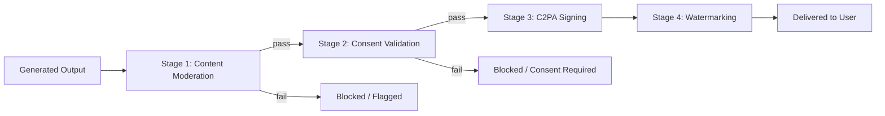
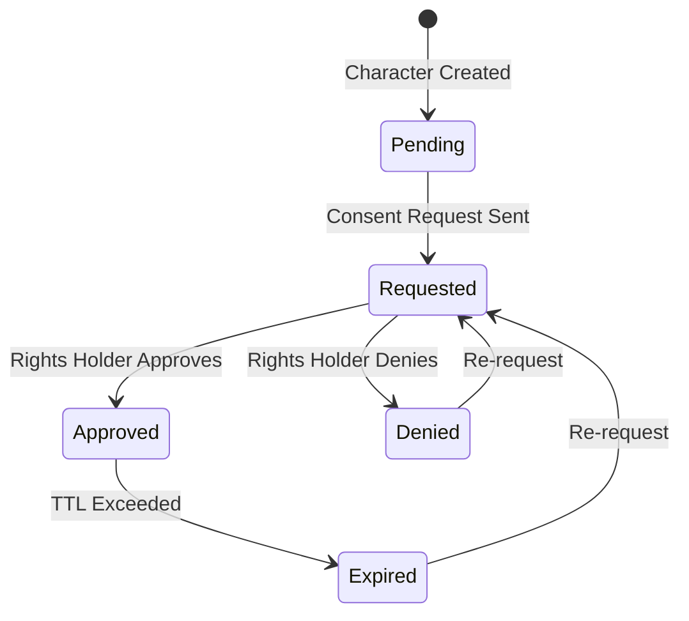

# AnimaForge Governance Pipeline

## Overview

Every piece of AI-generated content in AnimaForge passes through a mandatory 4-stage governance pipeline before delivery to users. This pipeline ensures content safety, provenance tracking, and rights compliance.



---

## Stage 1: Content Moderation

### Purpose
Scan all generated content for policy violations before any further processing.

### Checks Performed

| Check | Threshold | Action on Fail |
|-------|-----------|----------------|
| **NSFW** | Score > 0.15 | Block + flag for review |
| **Violence** | Score > 0.30 | Block + flag for review |
| **Bias/Stereotypes** | Score > 0.20 | Block + flag for review |
| **Copyright Similarity** | Score > 0.85 | Block + legal review |

### Process
1. Generated frames are sampled (every 12th frame for video, all frames for images)
2. Each sample is passed through the moderation model ensemble
3. Audio is transcribed and checked for harmful content
4. Scores are aggregated across all samples
5. If any check exceeds its threshold, the output is blocked

### Override Policy
- Enterprise admins can adjust thresholds within platform-defined bounds
- Human reviewers can override automated decisions with documented justification
- All overrides are recorded in the audit log

---

## Stage 2: Consent Validation

### Purpose
Verify that all character likenesses used in generated content have valid consent records.

### Consent Model



### Consent Types

| Type | Duration | Scope |
|------|----------|-------|
| **Perpetual** | Indefinite | All projects by this creator |
| **Project-scoped** | Duration of project | Single project only |
| **Time-limited** | Specified end date | All projects until expiry |
| **Commercial** | Per license agreement | Commercial use permitted |
| **Non-commercial** | Per license agreement | Personal/educational only |

### Validation Process
1. Extract all character IDs referenced in the generation job
2. For each character, query the `consent_records` table
3. Verify consent is in `approved` status and not expired
4. Verify consent scope matches the project's usage type
5. If any character lacks valid consent, block delivery and notify the creator

### Self-Owned Characters
Characters marked as `self_created: true` with no real-person likeness reference automatically pass consent validation. The creator is the sole rights holder.

---

## Stage 3: C2PA Signing

### Purpose
Create a verifiable Content Credentials manifest that documents the full provenance chain of generated content, compliant with the C2PA (Coalition for Content Provenance and Authenticity) specification.

### C2PA Manifest Structure

```json
{
  "claim_generator": "AnimaForge/2.0",
  "title": "shot_001_output.mp4",
  "format": "video/mp4",
  "instance_id": "xmp:iid:out_abc123",
  "claim_signature": {
    "algorithm": "ES256",
    "issuer": "AnimaForge Inc.",
    "time": "2026-03-25T08:35:01Z"
  },
  "assertions": [
    {
      "label": "c2pa.actions",
      "data": {
        "actions": [
          {
            "action": "c2pa.created",
            "softwareAgent": "AnimaForge-V2 Video Diffusion",
            "when": "2026-03-25T08:35:00Z",
            "parameters": {
              "model": "animaforge-v2",
              "quality": "high",
              "resolution": "1920x1080",
              "fps": 24
            }
          },
          {
            "action": "c2pa.edited",
            "softwareAgent": "AnimaForge Post-Processor",
            "when": "2026-03-25T08:35:00Z",
            "description": "Stabilization, upscaling, frame interpolation"
          }
        ]
      }
    },
    {
      "label": "c2pa.hash.data",
      "data": {
        "exclusions": [],
        "name": "jumbf manifest",
        "alg": "sha256",
        "hash": "base64-encoded-hash"
      }
    },
    {
      "label": "animaforge.generation",
      "data": {
        "project_id": "proj_abc123",
        "shot_id": "shot_001",
        "prompt": "Wide establishing shot of neon city at night",
        "style_preset": "cinematic",
        "character_ids": ["char_001"],
        "consent_verified": true,
        "moderation_passed": true
      }
    },
    {
      "label": "animaforge.governance",
      "data": {
        "moderation_score": { "nsfw": 0.02, "violence": 0.08 },
        "consent_status": "all_approved",
        "watermark_embedded": true
      }
    }
  ],
  "ingredient": []
}
```

### Signing Process
1. Assemble all assertion data (generation parameters, moderation results, consent status)
2. Compute content hash (SHA-256) over the output file
3. Create the C2PA claim with all assertions
4. Sign the claim using ES256 with the platform's private key (stored in HSM/KMS)
5. Embed the JUMBF manifest into the output file
6. Store a copy of the manifest in the `c2pa_manifests` table

### Verification
Users can verify any output at `https://animaforge.ai/verify/:outputId`, which:
1. Extracts the embedded C2PA manifest
2. Validates the signature against AnimaForge's public certificate
3. Verifies the content hash matches the file
4. Displays the full provenance chain to the user

---

## Stage 4: Watermarking

### Purpose
Embed an invisible, robust watermark into all generated content for traceability even when C2PA metadata is stripped.

### Watermark Encoding

The watermark encodes the following data into the spectral domain of the content:

| Field | Bits | Description |
|-------|------|-------------|
| `output_id` | 64 | Unique output identifier |
| `creator_id` | 32 | Creator's user ID hash |
| `timestamp` | 32 | Generation Unix timestamp |
| `version` | 8 | Watermark schema version |
| `checksum` | 8 | Error detection checksum |

Total payload: **144 bits** embedded across multiple frequency bands.

### Watermark Persistence

The watermark is designed to survive common transformations:

| Transformation | Survival Rate |
|---------------|---------------|
| JPEG compression (quality 50+) | 99.2% |
| H.264/H.265 re-encoding | 98.7% |
| Resolution scaling (50-200%) | 97.8% |
| Cropping (up to 30%) | 96.5% |
| Screenshot capture | 95.1% |
| Color adjustment | 94.3% |
| Social media re-compression | 93.8% |
| Print and re-scan | 87.2% |

### Embedding Process
1. Transform content into frequency domain (DCT for images, temporal DCT for video)
2. Select mid-frequency coefficients for embedding (balances robustness and invisibility)
3. Spread the 144-bit payload across selected coefficients using a secret spreading sequence
4. Apply strength modulation based on local content complexity (stronger in textured regions)
5. Inverse transform back to spatial domain
6. Quality verification: confirm PSNR > 45dB (imperceptible to human vision)

### Detection
The watermark detection API accepts any image or video and returns the embedded metadata if found:

```bash
curl -X POST https://ai.animaforge.ai/v1/governance/detect-watermark \
  -F "file=@screenshot.png"
```

```json
{
  "watermark_detected": true,
  "output_id": "out_abc123",
  "creator_id": "usr_001",
  "generated_at": "2026-03-25T08:35:00Z",
  "confidence": 0.97
}
```

---

## Pipeline Integration

### Timing
The governance pipeline adds approximately 2-5 seconds to total generation time:
- Content Moderation: ~1-2s (parallelized frame sampling)
- Consent Validation: ~100ms (database lookup)
- C2PA Signing: ~500ms (crypto operations)
- Watermarking: ~1-2s (frequency domain processing)

### Failure Handling
- If any stage fails, the output is quarantined (not delivered, not deleted)
- The creator receives a notification explaining which stage failed and why
- Quarantined outputs can be reviewed by admins in the governance dashboard
- Outputs that fail moderation 3 times are permanently blocked

### Audit Trail
Every governance pipeline execution creates an immutable audit record:

```sql
INSERT INTO audit_log (user_id, action, resource, resource_id, details)
VALUES (
  $1, 'governance_complete', 'generation_output', $2,
  '{"moderation_passed": true, "consent_valid": true, "c2pa_signed": true, "watermark_embedded": true, "pipeline_duration_ms": 3200}'
);
```
