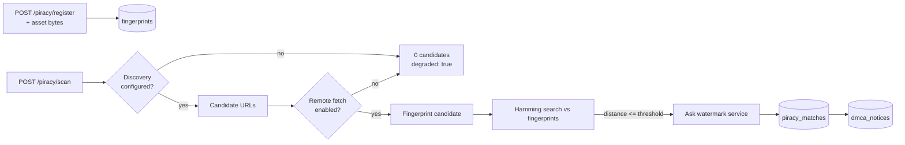

# Piracy Monitoring (X4)

Finding unauthorised copies of AnimaForge output on the open web.

The provenance side of this — how content is signed and watermarked in the first
place — is documented in [governance-pipeline.md](./governance-pipeline.md). This
document covers detection.

---

## The two signals

| Signal | Answers | Survives | Owner |
| --- | --- | --- | --- |
| **Perceptual fingerprint** | "Does this look like our content?" | Re-encode, rescale, brightness shifts | `services/piracy` |
| **Invisible watermark** | "Is this *our specific copy*, and whose?" | Re-encode, recompression | `services/governance/watermark` |

They answer different questions, and a match reports which one produced it.
A fingerprint hit says the content is ours; a recovered watermark payload also
identifies the job and licensee it came from, which is what makes a takedown
notice specific rather than speculative.

Neither survives everything. Nothing here should be described to a customer as
"unremovable".

---

## Pipeline



---

## Registration

```http
POST /piracy/register
{ "outputId": "...", "watermarkId": "...", "asset_base64": "...", "mime_type": "image/png" }
```

**Registering without asset bytes computes no fingerprint.** The response then
carries `fingerprinted: false` and a warning saying the content cannot be matched
by a scan. A row in a table is not protection.

Video registration uses `asset_path` instead — frames are streamed from disk via
ffmpeg rather than held in memory.

---

## Matching

```http
POST /piracy/match
{ "asset_base64": "...", "mime_type": "image/jpeg", "threshold": 10 }
```

Fingerprints the supplied bytes and returns every registered fingerprint within
the Hamming threshold, closest first. This is the honest core of X4: no network,
no discovery, just perceptual comparison of bytes the caller already has.

Each match carries:

- `distance` — Hamming distance out of 64 bits
- `similarity` — `1 - distance/64`
- `confidence` — `high` (≤4), `medium` (≤8), `low` (≤10)
- `distances` — pHash, aHash and dHash distances separately, so a reviewer can
  sanity-check a borderline hit rather than trusting one number

See [governance-pipeline.md §7](./governance-pipeline.md#7-perceptual-fingerprinting-x4)
for the measured robustness table and the crop/rotation limitation.

---

## Scanning

```http
POST /piracy/scan
{ "query": "my animation", "platforms": ["youtube", "tiktok"] }
```

Two stages, each independently gated:

1. **Discovery** needs `PIRACY_SEARCH_PROVIDER=http`, `PIRACY_SEARCH_ENDPOINT`
   and `PIRACY_SEARCH_API_KEY`. The endpoint receives
   `POST {query, platform, limit}` and must return
   `{results: [{url, title?, media_url?, thumbnail_url?}]}`.
2. **Verification** needs `PIRACY_ALLOW_REMOTE_FETCH=true` so candidate media can
   be downloaded and fingerprinted.

With neither configured — the default — the response is:

```json
{
  "total_matches": 0,
  "candidates_examined": 0,
  "candidates_fingerprinted": 0,
  "degraded": true,
  "reasons": ["No search provider configured...", "PIRACY_ALLOW_REMOTE_FETCH is not enabled..."]
}
```

It returns zero matches and says why. The previous implementation returned
`Math.floor(Math.random() * 3)` fabricated matches per scan, each with a random
confidence and a random `watermark_detected` boolean.

### Why discovery is pluggable rather than built in

Searching YouTube, TikTok and the rest for visually similar video needs a crawled
index that this repo does not have and cannot stand up. Rather than pretend, the
service defines the contract and reports honestly when nothing implements it.

---

## Watermark checks are tri-state

`watermark_detected` is `true`, `false`, or **`null`**.

`null` means the watermark service was not configured or not reachable, so no
check happened. That is deliberately not the same as `false`. Collapsing the two
would let an unconsulted service read as an exoneration, and the dashboard shows
them with different icons and copy for exactly that reason.

Set `WATERMARK_SERVICE_URL` to enable the check.

---

## Data written

A confirmed match writes a **`PiracyMatch`** row:

| Column | Meaning |
| --- | --- |
| `match_method` | `perceptual-hash` or `watermark` |
| `hamming_distance` | Distance the match was made at |
| `fingerprint_id` | FK to the registered `Fingerprint` |
| `watermark_id` | Recovered watermark, when there was one |
| `match_strength` | Similarity in 0..1 |
| `evidence` | JSON: algorithm, all three hash distances, threshold, confidence band |

Filing a takedown writes a **`DMCANotice`** row carrying the rendered `body`,
`platform` and `match_id`, and moves the match to `dmca_sent`.

Both tables live in the `20260814120000_real_provenance_watermark_fingerprint`
migration.

---

## Capabilities

```bash
curl -s localhost:3016/piracy/capabilities | jq
```

Reports image and video fingerprinting availability, the discovery provider, the
watermark service URL, the match threshold, and `known_limitations`. The piracy
dashboard reads this and shows a banner listing exactly what is missing, so the
UI never looks equally confident whether or not scanning is wired up.

---

## Operational notes

- **Fingerprint search is a linear scan.** It needs a BK-tree or ANN index beyond
  roughly 10⁵ fingerprints. `FINGERPRINT_SEARCH_LIMIT` caps how many rows are
  pulled per query (default 5000) — raise it deliberately, and know that a scan
  only compares against what it pulled.
- **Remote fetching is off by default.** A server that will fetch any URL on
  request is an SSRF pivot; enable it only where egress is controlled.
- **Video needs ffmpeg.** Nine frames are sampled evenly across the timeline
  (`FINGERPRINT_VIDEO_SAMPLES`).
- **Threshold tuning.** `FINGERPRINT_MATCH_THRESHOLD` defaults to 10 of 64 bits.
  Raising it catches more crops but closes the gap to unrelated content — on the
  measured data a 15% crop scores 24 and unrelated content 28. Do not raise it
  past ~14 without adding a second corroborating signal.

## Testing

```bash
npx vitest run services/piracy
```

Covers re-encode and rescale stability, separation of unrelated content,
end-to-end register → re-encode → match over HTTP, and a video round trip
(register an H.264 clip, match a rescaled CRF-32 re-encode of it, reject a
different clip). The video block is `describe.skip`ped with the reason in its
name when ffmpeg is absent — never silently.
