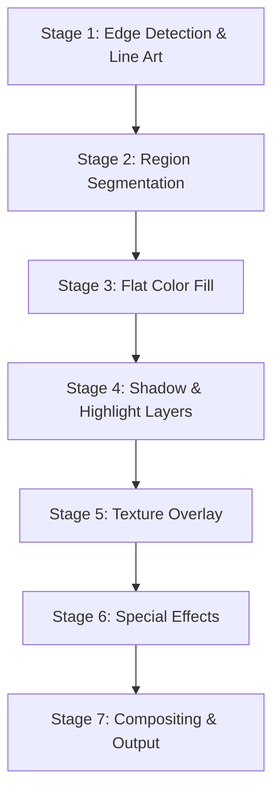

# Style Intelligence (X6)

## Overview

Style Intelligence (internal codename X6) is AnimaForge's style analysis, fingerprinting, and transfer engine. It enables users to capture the visual essence of any reference material and consistently apply that style across all generated content.

---

## Style Fingerprint Schema

A style fingerprint is a structured representation of visual style extracted from reference images or videos.

```json
{
  "id": "sf_neon_001",
  "name": "Cyberpunk Neon",
  "version": 2,
  "created_at": "2026-03-01T10:00:00Z",

  "palette": {
    "primary": ["#1a0a2e", "#ff007f", "#00ffff"],
    "secondary": ["#ffd700", "#8b00ff", "#00ff88"],
    "background": ["#0a0a0a", "#1a1a2e"],
    "accent": ["#ff4444", "#44ff44"],
    "distribution": {
      "dominant": "#1a0a2e",
      "dominant_ratio": 0.35,
      "harmony_type": "complementary"
    }
  },

  "line_work": {
    "weight": 0.72,
    "style": "clean",
    "edge_detection_threshold": 0.45,
    "outline_color": "#000000",
    "outline_width_px": 2.0,
    "taper": true
  },

  "texture": {
    "class": "cel_shade",
    "grain_intensity": 0.15,
    "noise_type": "perlin",
    "surface_detail": 0.6,
    "texture_vector": "[256-dim float array]"
  },

  "lighting": {
    "model": "dramatic_rim",
    "key_light_angle": 45,
    "key_light_intensity": 1.2,
    "fill_ratio": 0.3,
    "rim_light": true,
    "rim_intensity": 0.8,
    "ambient_occlusion": 0.4,
    "shadow_softness": 0.5,
    "shadow_color": "#1a0033"
  },

  "composition": {
    "aspect_preference": "16:9",
    "depth_of_field": "shallow",
    "camera_distance": "medium",
    "rule_of_thirds": true,
    "negative_space_ratio": 0.25
  },

  "motion": {
    "speed_class": "cinematic_slow",
    "easing": "ease_in_out",
    "camera_movement": "dolly",
    "transition_style": "dissolve",
    "frame_hold_tendency": 0.3
  },

  "mood_vector": "[128-dim float array]",
  "confidence": 0.94,

  "source": {
    "type": "reference_image",
    "urls": ["https://cdn.animaforge.ai/refs/style_ref_1.png"],
    "analyzed_frames": 1
  }
}
```

### Vector Embeddings

| Field | Dimensions | Model | Purpose |
|-------|-----------|-------|---------|
| `mood_vector` | 128 | Custom mood encoder | Semantic style similarity search |
| `texture_vector` | 256 | Custom texture encoder | Texture pattern matching |

Both vectors are stored in pgvector for fast nearest-neighbor retrieval.

---

## 7-Stage Cartoon Pipeline

The cartoon pipeline is a specialized rendering path for non-photorealistic styles. It transforms realistic generation output into stylized cartoon/anime content.



### Stage 1: Edge Detection & Line Art

**Purpose**: Extract clean linework from the generated content to form the cartoon outline layer.

**Process**:
- Apply Canny edge detection with adaptive thresholds based on style fingerprint `edge_detection_threshold`
- Run a learned line art extraction model trained on professional animation production
- Clean up artifacts: remove short segments, connect broken lines, smooth jagged edges
- Apply line weight variation based on depth (closer = thicker) and curvature
- Color lines according to fingerprint `outline_color`
- Apply line taper at endpoints if `taper: true`

**Output**: Clean vector-like line art layer at full resolution

### Stage 2: Region Segmentation

**Purpose**: Divide the image into semantically meaningful regions for flat color assignment.

**Process**:
- Run SAM (Segment Anything Model) for initial segmentation
- Merge over-segmented regions based on color similarity and spatial proximity
- Classify regions by semantic type: skin, hair, clothing, background, props, sky
- Generate a region map with unique IDs per segment
- Create smooth region boundaries aligned to the line art from Stage 1

**Output**: Region segmentation map with semantic labels

### Stage 3: Flat Color Fill

**Purpose**: Apply the style fingerprint's color palette to each region.

**Process**:
- Map each semantic region to the appropriate palette category:
  - Skin tones mapped from `palette.primary`
  - Hair/clothing from `palette.secondary`
  - Background from `palette.background`
  - Props/accents from `palette.accent`
- Apply flat fill within each region boundary
- Ensure color consistency across frames (temporal coherence for video)
- Apply palette harmony corrections to maintain the fingerprint's `harmony_type`

**Output**: Flat-colored image with consistent palette application

### Stage 4: Shadow & Highlight Layers

**Purpose**: Add depth and dimension through stylized shading.

**Process**:
- Compute light direction from fingerprint `lighting.key_light_angle`
- Generate shadow regions using depth estimation + normal mapping
- Apply cel-shading quantization (2-4 discrete shadow levels based on style)
- Shadow color derived from fingerprint `lighting.shadow_color`
- Add highlight spots using `lighting.rim_light` and `lighting.rim_intensity`
- Ambient occlusion applied at `lighting.ambient_occlusion` intensity
- Soften shadow edges according to `lighting.shadow_softness`

**Output**: Shadow and highlight layers composited over flat colors

### Stage 5: Texture Overlay

**Purpose**: Apply surface texture patterns matching the style fingerprint.

**Process**:
- Select texture patterns based on fingerprint `texture.class`:
  - `cel_shade`: Clean, minimal texture
  - `watercolor`: Paper grain with color bleeding edges
  - `oil_paint`: Brush stroke simulation with impasto
  - `pencil_sketch`: Hatching and cross-hatching patterns
  - `pixel_art`: Nearest-neighbor quantization to pixel grid
- Apply texture at `texture.grain_intensity` strength
- Use fingerprint `texture.noise_type` for procedural variation
- Modulate texture density by `texture.surface_detail`
- Ensure texture coherence across video frames

**Output**: Textured render with surface character

### Stage 6: Special Effects

**Purpose**: Add style-specific effects that enhance the overall aesthetic.

**Process**:
- **Glow/Bloom**: For neon/cyberpunk styles, add bloom on bright regions
- **Speed Lines**: For action sequences, generate radial or parallel motion lines
- **Screen Tones**: For manga styles, apply halftone dot patterns
- **Particles**: Sparkles, dust motes, rain, snow based on scene context
- **Chromatic Aberration**: Subtle color fringing for cinematic styles
- **Film Grain**: Analog film grain overlay for retro aesthetics
- **Vignette**: Edge darkening based on composition preferences

All effects are parameterized by the style fingerprint and can be individually toggled.

**Output**: Effects layers ready for final compositing

### Stage 7: Compositing & Output

**Purpose**: Assemble all layers into the final stylized output.

**Layer Stack** (bottom to top):
1. Background color/gradient
2. Flat color fill
3. Shadow layer (multiply blend)
4. Highlight layer (screen blend)
5. Texture overlay (overlay blend)
6. Line art (multiply blend)
7. Special effects (additive/screen blend)

**Process**:
- Composite all layers with appropriate blend modes
- Apply final color grading to match fingerprint mood
- Temporal smoothing for video (prevent flickering between frames)
- Output at target resolution and format

**Output**: Final stylized frame or video

---

## Style Analysis API

### Analyze a Reference

```bash
POST /ai/v1/style/analyze
{
  "source_url": "https://example.com/reference.png",
  "extract_palette": true,
  "extract_textures": true,
  "extract_lighting": true,
  "extract_composition": true,
  "extract_motion": false
}
```

### Response

```json
{
  "fingerprint_id": "sf_abc123",
  "palette": {
    "primary": ["#1a0a2e", "#ff007f", "#00ffff"],
    "harmony_type": "complementary"
  },
  "line_weight": 0.72,
  "texture_class": "cel_shade",
  "lighting_model": "dramatic_rim",
  "mood_vector": "[128-dim array]",
  "confidence": 0.94
}
```

### Apply Style Transfer

```bash
POST /ai/v1/style/transfer
{
  "job_id": "job_xyz789",
  "fingerprint_id": "sf_abc123",
  "intensity": 0.85,
  "preserve_identity": true,
  "cartoon_pipeline": true,
  "stages_override": {
    "special_effects": {
      "glow": true,
      "speed_lines": false,
      "film_grain": true
    }
  }
}
```

### Find Similar Styles

```bash
POST /ai/v1/style/search
{
  "fingerprint_id": "sf_abc123",
  "limit": 5
}
```

Returns the 5 most similar style fingerprints using cosine similarity on `mood_vector` via pgvector.

---

## Style Presets

AnimaForge includes built-in style presets that users can apply without creating their own fingerprint:

| Preset | Description | Cartoon Pipeline |
|--------|-------------|:---:|
| `cinematic` | Photorealistic, dramatic lighting, shallow DoF | No |
| `anime` | Clean lines, flat colors, expressive eyes | Yes |
| `cartoon` | Bold outlines, bright palette, exaggerated features | Yes |
| `cel_shade` | Classic animation cel look, 2-tone shading | Yes |
| `watercolor` | Soft edges, color bleeding, paper texture | Yes |
| `oil_paint` | Thick brush strokes, rich colors, impasto texture | Yes |
| `pixel_retro` | Low-resolution pixel art with limited palette | Yes |
| `noir` | High contrast, black and white, dramatic shadows | Partial |
| `pastel_dream` | Soft pastels, low contrast, dreamy atmosphere | Yes |
| `comic_book` | Bold lines, halftone dots, vibrant primaries | Yes |

Users can also create custom presets from analyzed fingerprints and share them on the marketplace.
